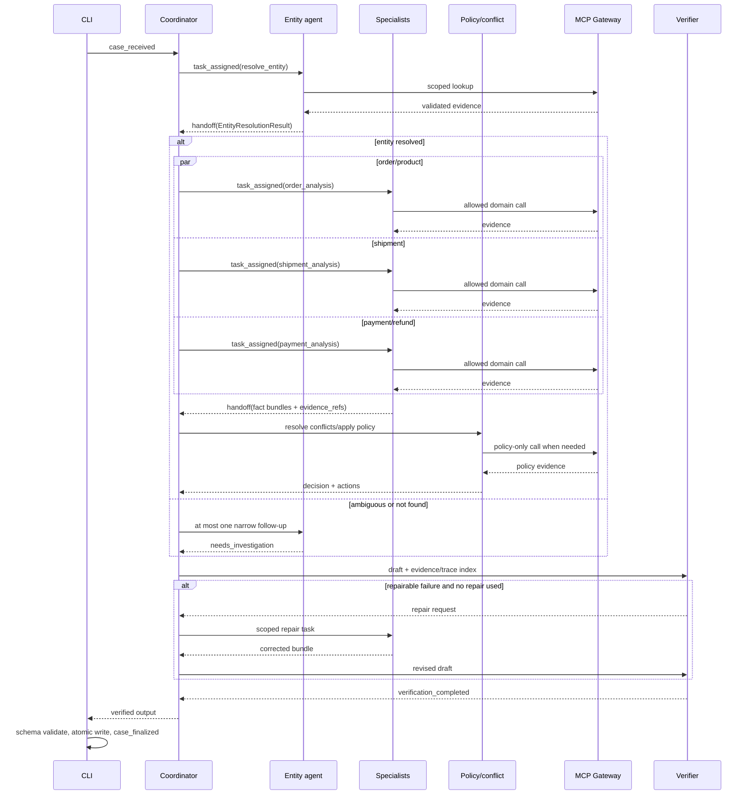

# L3B Architecture Record

## 0. Phạm vi và trạng thái

Tài liệu này là hợp đồng thiết kế cho workflow L3B trong
`src/student_agent/workflow.py`. Team phải cập nhật tài liệu cùng source khi thay đổi
vai trò agent, quyền gọi tool, quy tắc chọn evidence, ngân sách truy vấn hoặc cấu trúc
handoff.

Starter kit cung cấp lớp tải input, kết nối MCP, kiểm tra JSON Schema, ghi trace,
validate artifact và đóng gói submission. Lõi A2A, quyền tool, cache/retry, facade
specialist và verifier thuần schema/consistency đã được triển khai trong
`coordinator_router.py`, `mcp_evidence_collector.py`, `specialist_agents.py`,
`verifier_agent.py` và `run_case_with_handlers()` trong `workflow.py`. `solve_case()`
đã nối catalog 8 MCP tool được review, handlers theo domain và output mapping trong
`case_adapter.py`; các phép chuẩn hóa thuần dữ liệu nằm trong `domain_analysis.py`.
Adapter xác minh quan hệ customer/order, chọn snapshot có purchase timestamp gần
nhất không sau `opened_at`, giới hạn item/payment/refund vào khoảng purchase đó,
và áp dụng đúng `policy_version` cho issue đã được chứng minh bằng evidence.
Claim text chỉ định phạm vi điều tra, không quyết định kết luận.

Luồng thông thường dùng 7 calls khi cần product context; thêm refund timeline cho
claim pending/failed (8 calls). Payment timeline đã chứa ledger rows nên không gọi
lặp `get_order_payments`. Không tự tạo shipment/payment ID nếu response không có.
Amount `refund_brl`, action và case status lấy từ policy đang áp dụng; amount bị
chặn trên bởi capture trừ refund đã biết. Refund chưa xác minh được giữ `null`.
Mỗi claim trích refs của nhóm specialist liên quan, thay vì sao chép mọi ref.

Lõi hiện enforce tối đa 12 MCP attempts/case, 2 attempts cho mỗi call transient,
12 handoffs và tối đa 3 task đồng thời; đồng thời kiểm schema output, case ID,
evidence đã consume, candidate bị reject, refund line total và một số nhất quán
status/action và domain evidence tối thiểu cho kết luận. Reconnect session, quyền
tool `C`, repair pass tự động và scoring candidate fuzzy chưa được implement.
Đối chiếu team/run với MCP Audit vẫn thuộc server, không thể suy ra từ trace local.

Nguồn chuẩn, theo thứ tự ưu tiên:

1. JSON Schema trong `contracts/schemas/` quyết định hình dạng artifact.
2. `contracts/scoring/scoring-policy-v2.json` quyết định hard gate và cách chấm.
3. MCP response đã qua `EvidenceGateway` là nguồn dữ liệu nghiệp vụ.
4. Tài liệu này quyết định cách phối hợp agent khi contract công khai không quy định.

Không ghi prompt bí mật, chain-of-thought, API key hoặc dữ liệu ngoài phạm vi case vào
output hay trace. Trace chỉ chứa sự kiện có thể quan sát và kiểm chứng.

## 1. System overview

Mỗi case được xử lý độc lập theo pipeline sau:

```text
case-set.json + inputs/<case_id>.json
                  |
                  v
          Input validation
                  |
                  v
             Coordinator
                  |
          entity handoff task
                  v
        Entity/customer agent <------> MCP Gateway
                  |
          resolved candidate set
                  v
             Coordinator
          /          |          \
         v           v           v
 Order/product   Shipment   Payment/refund
    specialist   specialist    specialist
         \           |           /
          \----- evidence -------/
                    |
                    v
          Policy/conflict resolver <----> MCP policy evidence
                    |
                    v
                 Verifier
              |             |
              v             v
 outputs/<case_id>.json   traces/trace.jsonl
```

`day09 run` tải đúng 100 input, discovery tool một lần khi mở MCP session, rồi xử lý
case theo thứ tự trong `case-set.json`. Trước mỗi case, CLI phát `case_received`; sau
khi `solve_case()` trả về và output pass schema, CLI ghi file theo cơ chế temporary
file + atomic replace rồi phát `case_finalized`. Khi chạy lại, CLI kiểm tra
output/trace của prefix đã hoàn tất và tiếp tục từ case đầu tiên chưa finalize.
Trace của một attempt lỗi được giữ lại để thể hiện retry; case hoàn tất không gọi
lại MCP.

Ba lớp contract bảo vệ biên hệ thống:

- `EvidenceGateway` luôn thêm `case_id`, nhận structured content (hoặc đúng một JSON
  text block) và validate `mcp-evidence-response-v1` trước khi trả dữ liệu cho agent;
- `TraceWriter` tạo `event_id`, UTC timestamp, validate từng event rồi append JSONL;
- `Contracts` validate output L3B, trace, evidence và manifest bằng JSON Schema Draft
  2020-12.

## 2. Thành phần và quyền sở hữu

| Actor | Input | Trách nhiệm | Quyền tool | Output/handoff |
| --- | --- | --- | --- | --- |
| Entity/customer agent | Input case, candidate ban đầu | Chuẩn hóa identifier, xếp hạng/reject candidate, xác định order và customer context | Chỉ tool domain `order`, `customer`; dùng domain khác chỉ để xác minh identifier đã có | `EntityResolutionResult` cho coordinator |
| Coordinator | Case, kết quả entity resolution, danh sách tool discovery | Lập kế hoạch hữu hạn, giao task, quản lý budget/cache, gom kết quả | Không tự quét dữ liệu nghiệp vụ; được discovery tool và chuyển yêu cầu hợp lệ cho specialist | Task envelope và bản nháp case assessment |
| Order/product specialist | Order đã resolve và claim liên quan item/seller | Kiểm tra trạng thái order, item, product, seller và quan hệ sở hữu | Tool domain `order`, `item`, `product`, `seller` | Fact/claim bundle kèm evidence refs |
| Shipment specialist | Order/shipment ID đã resolve | Dựng timeline, phân biệt seller delay, logistics delay, lost/returned | Tool domain `shipment`; đọc order fact đã handoff | Shipment analysis kèm evidence refs |
| Payment/refund specialist | Order/payment reference đã resolve | Reconcile capture/refund, tính tổng BRL và refundable amount | Tool domain `payment`, `refund`; không quyết định policy | Payment analysis kèm evidence refs |
| Policy/conflict resolver | Fact bundle, conflict và policy question cụ thể | Áp dụng source precedence, policy hiệu lực và biểu diễn conflict chưa giải quyết | Tool domain `policy`; không tự mở rộng candidate | Conflict decisions, root cause, action/refund đề xuất |
| Verifier | Draft output, toàn bộ evidence index và trace index của case | Kiểm tra invariants, hạ confidence hoặc chặn finalize | Không gọi MCP trong đường chạy chuẩn; chỉ trả task bổ sung có scope cho coordinator | `verification_completed` và output hợp lệ hoặc lỗi hữu hạn |

### 2.1 Least privilege

Tool discovery cho biết khả năng của server, không tự cấp quyền cho mọi actor.
Coordinator lấy giao của danh sách tên tool đã discovery với catalog được team review
trong source (`tool_name -> domain, actor được phép, tham số bắt buộc`). Wrapper
trả cả input schema và kiểm tra các tham số bắt buộc trước khi xử lý case.
Tool không có trong catalog hoặc không nằm trong allowlist của actor phải bị từ chối
trước khi gọi MCP.

Mọi call phải có `case_id` hiện tại. Identifier trong arguments phải xuất phát từ
input hiện tại hoặc evidence đã được consume trong cùng case. Agent không được đoán
tên tool, tự tạo `evidence_ref`, gọi tool ghi dữ liệu, hoặc dùng evidence giữa hai
case.

### 2.2 Ma trận tool permissions

`A` là được phép gọi, `C` là chỉ được phép khi xác minh identifier cụ thể đã có trong
input/evidence, `-` là bị chặn. `ScopedEvidence` hiện enforce các ô `A` qua
`ToolSpec` và chặn ô `-`. Các ô `C` cần adapter kiểm nguồn gốc identifier nên chưa
được bật. Quyền chỉ áp dụng cho tool vừa có trong catalog được review, vừa xuất hiện
trong kết quả discovery.

| Actor | Discovery | order | customer | item/product/seller | shipment | payment/refund | policy |
| --- | :---: | :---: | :---: | :---: | :---: | :---: | :---: |
| Coordinator/bootstrap | A | - | - | - | - | - | - |
| Entity/customer agent | - | A | A | - | C | C | - |
| Order/product specialist | - | A | - | A | - | - | - |
| Shipment specialist | - | C | - | - | A | - | - |
| Payment/refund specialist | - | C | - | - | - | A | - |
| Policy/conflict resolver | - | - | - | - | - | - | A |
| Verifier | - | - | - | - | - | - | - |

Mọi agent dùng chung một gateway object ở tầng kỹ thuật, nhưng wrapper gọi tool phải
nhận thêm actor context và kiểm tra ma trận trước khi chuyển sang `EvidenceGateway`.
Coordinator giao quyền theo task, không làm proxy để specialist vượt allowlist.
Verifier chỉ đọc draft, evidence index và trace index đã có; nếu thiếu evidence, nó
trả repair request cho coordinator thay vì tự gọi MCP.

## 3. Entity resolution và A2A protocol

### 3.1 Candidate resolution

Entity/customer agent thực hiện tuần tự, dừng ngay khi đã đủ chắc chắn:

1. Chuẩn hóa identifier nhưng giữ nguyên raw value để đối chiếu; không fuzzy-match ID.
2. Nếu input có exact order ID, xác minh bằng order evidence. Match duy nhất nhận điểm
   `1.00`; identifier không tồn tại bị reject.
3. Nếu không có exact order ID, tạo tối đa 5 candidate từ identifier mạnh có trong
   input (payment reference, shipment ID, customer/order relation). Không quét rộng
   toàn bộ lịch sử nếu chưa có customer định danh.
4. Chấm candidate theo evidence độc lập:
   - exact payment/shipment reference: `+0.55`;
   - exact customer identity: `+0.25`;
   - amount/currency khớp: `+0.10`;
   - time window hoặc seller/item khớp: `+0.10`;
   - một hard contradiction về customer, payment hoặc shipment: reject ngay.
5. `resolved` khi candidate đầu có điểm ít nhất `0.85`, không có hard contradiction
   và hơn candidate thứ hai ít nhất `0.10`. Các candidate còn lại đi vào
   `rejected_candidates`.
6. `ambiguous` khi còn từ hai candidate hợp lệ nhưng không đạt margin; `not_found`
   khi không còn candidate. Hai trạng thái này không được tự chọn một order để tiếp
   tục: output dùng `needs_investigation`, confidence không quá `0.50`, các phân tích
   thiếu evidence dùng verdict `insufficient_evidence`.

`resolved_order_ids` chỉ chứa order có evidence xác minh. `related_order_ids` có thể
chứa lịch sử của cùng customer nhưng không tự động trở thành `affected_entities`.

### 3.2 A2A message envelope

Handoff nội bộ là typed object (dataclass/TypedDict hoặc model tương đương), tối thiểu
có các field sau:

```json
{
  "message_id": "msg_<unique>",
  "case_id": "L3B_CASE_001",
  "correlation_id": "<case_id>",
  "causation_id": "<parent message_id or null>",
  "from": "coordinator",
  "to": "shipment-agent",
  "task": "build_shipment_timeline",
  "entity_ids": {"order_ids": ["..."]},
  "claim_ids": ["claim_1"],
  "evidence_refs": ["ev_..."],
  "attempt": 1,
  "deadline_ms": 30000,
  "status": "requested"
}
```

Payload chỉ truyền identifier, claim, kết luận ngắn và evidence reference; không
truyền chain-of-thought. Receiver kiểm tra `case_id`, target, schema, deadline và
quyền domain trước khi xử lý.

Lifecycle hợp lệ là `requested -> accepted -> completed|failed|timed_out`. Một
`message_id` chỉ được consume một lần; retry tạo message mới và trỏ `causation_id`
về lần trước. Coordinator duy trì tập `(case_id, task, canonical arguments)` đã xử
lý để chống duplicate và vòng lặp. Một task có tối đa 2 attempts, tối đa 2 handoff
giữa cùng một cặp actor và toàn case tối đa 12 handoffs. Specialist không giao việc
trực tiếp cho specialist khác; mọi mở rộng scope quay lại coordinator.

Trace ánh xạ A2A như sau:

- coordinator phát `task_assigned` với `actor`, `target`, `decision_code` và thuộc
  tính không nhạy cảm;
- khi chuyển fact bundle, sender phát `handoff`;
- actor thực sự sử dụng MCP result phát `tool_result_consumed`, nêu `tool_name` và
  đúng các `evidence_refs`;
- verifier phát đúng một `verification_completed` cho mỗi case, với decision code
  `PASS`, `PASS_WITH_LIMITATIONS` hoặc `FAIL`.

### 3.3 Luồng handoff chuẩn



Nhánh rẽ chính:

- entity `resolved`: coordinator mới fan-out các specialist độc lập;
- entity `ambiguous/not_found`: không fan-out điều tra rộng, chỉ cho phép một query
  hẹp bổ sung rồi assembly kết quả `needs_investigation`;
- specialist failure: handoff failure envelope về coordinator, không chuyển trực tiếp
  cho specialist khác;
- verifier `FAIL`: coordinator được một repair pass. `FAIL` lần hai chặn finalize;
- mọi handoff phải giữ nguyên `case_id`/`correlation_id`, tạo `message_id` mới và trỏ
  `causation_id` về message sinh ra nó.

## 4. Evidence và conflict lifecycle

### 4.1 Evidence lifecycle

1. Agent yêu cầu tool đã được discovery với arguments tối thiểu và `case_id` hiện tại.
2. Gateway từ chối MCP error, response không phải một object, hoặc object sai schema.
3. Coordinator ghi evidence index theo `evidence_ref` gồm `result_hash`, `domain`,
   canonical call key và actor đã consume. `evidence_ref` và `result_hash` do server
   cấp, không được sửa.
4. Chỉ khi một fact/claim thực sự dùng dữ liệu, agent mới phát
   `tool_result_consumed`. Call không liên quan không được đưa vào output chỉ để tăng
   số evidence. Trạng thái consume được lưu theo cặp `(actor, evidence_ref)`, vì hai
   specialist cùng dùng một ref đều phải có event audit của chính mình.
5. Mọi claim assessment và mọi field quyết định assessment/refund/action phải truy
   ngược được đến ít nhất một evidence ref phù hợp. `output.evidence_refs` là hợp
   của evidence thực sự hỗ trợ output, không phải toàn bộ call đã thực hiện.
6. Cache và evidence index bị hủy khi kết thúc case; không có cache xuyên case.

Cache key là `(case_id, tool_name, canonical_json(arguments))`. Kết quả cache chỉ
được dùng khi `result_hash` còn khớp với entry ban đầu. Hai response cùng field nhưng
khác hash không bị âm thầm ghi đè; chúng đi vào conflict resolver.

### 4.2 Source precedence

Conflict resolver chọn nguồn theo field, không dùng một thứ tự chung cho mọi dữ liệu:

| Field | Nguồn ưu tiên | Quy tắc |
| --- | --- | --- |
| Order/item status và ownership | Record đúng domain `order`/`item` | Record trực tiếp thắng bản tóm tắt customer hoặc claim text |
| Shipment timestamp/status | Event `shipment` có timestamp | Timeline event thắng derived order status; timestamp bất khả thi vẫn là conflict |
| Captured/refunded amount | Transaction `payment`/`refund` | Cộng transaction hợp lệ theo reference; không suy tiền từ order total |
| Customer/order relation | Record `customer` đã xác minh | Không nối chỉ bằng tên hoặc dữ liệu fuzzy |
| Refund eligibility/action | Evidence `policy` áp dụng cho fact đã xác minh | Policy quyết định eligibility, không thay thế transaction fact |
| User claim | Input case | Là assertion cần kiểm chứng, không phải system of record |

Precedence chỉ được áp dụng sau khi xác định cùng thời điểm nghiệp vụ: nếu direct
order snapshot thuộc một purchase khác với case, history có snapshot đúng thời
điểm được chọn và bất đồng được ghi thành `CASE_TIME_WINDOW`. Payment/shipment
event ngoài khoảng purchase không được trộn vào tổng tiền/timeline của case.

Mỗi bất đồng có ảnh hưởng output được ghi vào `data_conflicts` với field, ít nhất hai
source, `selected_source` và `resolution_code` ổn định (ví dụ
`DIRECT_DOMAIN_RECORD`, `LATEST_TIMESTAMPED_EVENT`, `POLICY_PRECEDENCE`). Nếu không
thể chọn nguồn hợp lệ, đặt `selected_source: null`, dùng
`resolution_code: UNRESOLVED_INSUFFICIENT_EVIDENCE`, hạ verdict liên quan về
`insufficient_evidence`, đặt case `needs_investigation` và không đề xuất refund dương
nếu số tiền chưa được chứng minh.

## 5. Failure và efficiency policy

| Failure | Retry budget | Fallback | Trace decision code |
| --- | ---: | --- | --- |
| MCP connect/session failure | 1 reconnect cho run | Dừng run; không tạo output giả | CLI error; chưa finalize case |
| MCP tool timeout/transient error | Tối đa 1 retry cùng canonical arguments | Đánh dấu task failed; dùng `insufficient_evidence` nếu output vẫn an toàn | Handoff `MCP_RETRY_EXHAUSTED` |
| MCP permanent error hoặc response sai schema | 0 | Không consume response; trả failure cho coordinator | Handoff `INVALID_MCP_RESPONSE` |
| Entity not found/ambiguous | Tối đa 1 query hẹp bổ sung | `needs_investigation`, confidence ≤ 0.50 | `ENTITY_NOT_FOUND` / `ENTITY_AMBIGUOUS` |
| Source conflict | 0 retry nếu không có nguồn mới cụ thể | Áp dụng precedence hoặc biểu diễn unresolved conflict | `CONFLICT_RESOLVED` / `CONFLICT_UNRESOLVED` |
| Specialist result sai envelope/thiếu evidence | 1 lần yêu cầu sửa, không tự mở rộng scope | Loại result và hạ trạng thái | `INVALID_SPECIALIST_RESULT` |
| Verification fail có thể sửa | 1 repair pass qua coordinator | Verify lại; nếu vẫn fail thì không finalize | `REPAIR_REQUIRED` / `FAIL` |

### 5.1 MCP retry state machine

```text
CALL_REQUESTED
      |
      v
permission + scope + cache + budget check
      | rejected --------------------------> FAIL_CLOSED
      | cache hit -------------------------> RETURN_CACHED
      v
ATTEMPT_1
      | success + valid schema ------------> INDEX_EVIDENCE -> RETURN
      | permanent/schema error ------------> FAIL_CLOSED
      | transient error
      v
backoff 250 ms
      |
      | transport failure; reconnect requires session adapter
      v
ATTEMPT_2 (same canonical arguments)
      | success + valid schema ------------> INDEX_EVIDENCE -> RETURN
      | any error --------------------------> RETRY_EXHAUSTED -> FALLBACK/ABORT
```

Phân loại lỗi:

- **transient:** timeout, connection reset, HTTP `408`, `429`, `5xx`, hoặc MCP error
  có code rõ ràng là retryable;
- **permanent:** `401/403`, invalid arguments, tool không tồn tại/không được phép,
  business rejection, hoặc MCP error không khai báo retryable;
- **invalid response:** JSON parse, evidence schema, `evidence_ref`/`result_hash` sai
  định dạng hoặc xung đột với per-case index; xem như permanent vì gọi lại cùng input
  không sửa được contract violation.

Retry phải idempotent: attempt 2 dùng cùng `case_id`, tool name và canonical arguments,
nhưng không consume/index response lỗi của attempt 1. Cache được kiểm tra trước khi
tính call vào client budget; attempt thực sự gửi tới MCP đều được scorer audit. Nếu
budget đã hết, deadline 30 giây đã qua hoặc case bị hủy thì không retry.

Trong lõi hiện tại, lỗi sau attempt 2 được ném cho handler; handler nghiệp vụ cần
chuyển thành `handoff` failure với decision code `MCP_RETRY_EXHAUSTED`. Không phát
`tool_result_consumed` cho response lỗi. Coordinator chỉ tiếp tục
với `insufficient_evidence` khi verifier xác nhận output vẫn an toàn. Nếu evidence
thiếu thuộc hard gate hoặc không thể tạo output nhất quán, workflow dừng case thay vì
tạo dữ liệu giả.

Efficiency được kiểm soát bằng các nguyên tắc sau:

- discovery một lần cho mỗi MCP session;
- query hẹp trước, mở rộng theo evidence mới, không gọi kiểu “lấy tất cả”;
- tối đa 5 candidate và không quá 2 calls cho việc loại một candidate;
- deduplicate theo cache key trước mọi call;
- `ScopedEvidence` đang enforce mặc định 12 MCP attempts/case; cơ chế mở rộng tối đa
  18 calls với `BUDGET_EXTENSION` cần được bổ sung khi có policy nghiệp vụ cụ thể;
- verifier không gọi tool trực tiếp, tránh chu kỳ “verify rồi điều tra lại” không giới
  hạn.

Giới hạn trên là policy phía client. Budget riêng của scorer là private; mọi MCP call
được server audit đều được tính, kể cả call không xuất hiện trong output.

## 6. Output assembly và verification invariants

Coordinator chỉ assembly output sau khi nhận các fact bundle hợp lệ. Verifier chạy
trên draft đã assembly và evidence/trace index, theo thứ tự fail-fast sau:

1. **Schema:** đúng `day09-l3b-output-v2`, không có additional property, mọi enum,
   cardinality và confidence nằm trong `[0, 1]`.
2. **Case scope:** output `case_id` bằng input; mọi entity và evidence thuộc đúng
   team/run/case hiện tại; không có evidence cache từ case khác.
3. **Entity resolution:** resolved order nằm trong candidate đã xác minh; candidate
   bị reject không xuất hiện trong affected entity, customer context hay specialist
   task; `ambiguous/not_found` không được giả vờ có exact resolution.
4. **Evidence ownership:** mọi `evidence_refs` do MCP cấp, tồn tại trong evidence
   index, đã có `tool_result_consumed`, hash không bị thay đổi và domain liên quan đến
   claim/field nó hỗ trợ.
5. **Claim linkage:** từng `claim_assessments[*]` có evidence riêng; verdict
   `supported/unsupported/partially_supported` không được có danh sách evidence rỗng.
6. **Timeline:** shipment event có thứ tự thời gian hợp lệ; `timeline_complete: true`
   chỉ khi đủ mốc để kết luận; seller delay phải nối được seller với item/order.
7. **Payment arithmetic:** mọi giá trị BRL không âm; tổng capture/refund được tính từ
   transaction evidence; `refundable = max(eligible - refunded, 0)` và làm tròn 2 chữ
   số thập phân. Tổng `refund_lines.amount_brl` bằng `recommended_refund_brl`.
8. **Conflict:** nguồn mâu thuẫn không bị silently overwritten; mọi unresolved
   conflict ảnh hưởng kết luận phải hạ verdict/status/confidence tương ứng.
9. **Cross-field consistency:** `no_action` không đi cùng refund dương hoặc action yêu
   cầu can thiệp; `action_required` phải có ít nhất một action; refund dương phải có
   payment/refund/policy evidence và action tương ứng; action không trùng lặp.
10. **Responsibility:** `late_seller_ids` là tập con seller bị ảnh hưởng; responsible
    party và cause code phải phù hợp shipment/payment verdict, conflict và action.
11. **Confidence:** confidence phản ánh mắt xích yếu nhất, không chỉ số lượng evidence.
    Trần đề xuất: `0.50` khi entity chưa resolve hoặc conflict chính chưa giải quyết,
    `0.75` khi thiếu timeline/financial evidence phụ, và chỉ trên `0.90` khi entity,
    claim, timeline/tài chính và policy đều được evidence trực tiếp xác minh.
12. **Trace lifecycle:** có `case_received`, ít nhất một `task_assigned`, handoff giữa
    ít nhất hai actor, `verification_completed`; `case_finalized` chỉ do CLI phát sau
    khi output pass schema. Thứ tự timestamp phải phù hợp lifecycle.

Verifier phát `PASS` khi tất cả invariant bắt buộc đạt; `PASS_WITH_LIMITATIONS` chỉ
khi output an toàn, đúng schema và biểu diễn rõ thiếu evidence; `FAIL` chặn trả output
cho CLI. Không được tạo fallback answer chỉ để pass schema.

### 6.1 Policy engine và calibration

`policy_agent.py` nhận fact bundle đã chuẩn hóa từ specialist và áp dụng decision table theo
thứ tự ưu tiên: trạng thái order đã thu tiền, lỗi payment/refund, lỗi shipment, split
payment hợp lệ, claim bị bác bỏ, rồi mới tới `insufficient_evidence`. Engine không tự
tạo refund: số tiền dương chỉ xuất hiện khi có `refundable_total_brl` từ evidence hoặc
có thể tính trực tiếp phần capture vượt order total / phần đơn đã hủy chưa hoàn.

Trách nhiệm được ràng buộc theo issue: seller delay chỉ gán `seller`, logistics delay
chỉ gán `logistics_provider`, còn mismatch/duplicate/refund gán payment provider hoặc
platform. Verifier chặn party ngoài tập hợp hợp lệ, refund không có `issue_refund`,
refund cho issue phi tài chính và issue actionable không có action/party.

Confidence lấy mắt xích yếu hơn giữa entity confidence và evidence coverage, sau đó
áp trần `0.50` cho conflict chưa giải quyết hoặc insufficient evidence, `0.85` khi có
conflict đã giải quyết và `0.75` khi analysis/timeline chưa hoàn chỉnh. Artifact
validator kiểm chuỗi đầy đủ `case_received -> task_assigned -> tool_result_consumed
-> handoff -> policy_decided -> verification_completed -> case_finalized` và liên kết
mọi output evidence ref với consumption trace.

## 7. Reproducibility và vận hành

### 7.1 Runtime được kiểm soát

- Python: `>=3.11` theo `pyproject.toml`.
- Dependency có major-version bounds trong `pyproject.toml`; release chính thức nên
  lưu lock file kèm hash để tái lập chính xác. Không tuyên bố reproducible tuyệt đối
  nếu chưa có lock file.
- CLI xử lý case tuần tự. Bên trong một case, chỉ chạy song song các specialist độc
  lập sau khi entity resolution hoàn tất; semaphore giới hạn tối đa 3 task.
- Sort candidate, tool name, entity ID, evidence ref và output set trước assembly để
  concurrency không đổi kết quả.
- Không dùng random trong quyết định nghiệp vụ. `TraceWriter` dùng secure random cho
  `event_id` và clock UTC cho timestamp, nên hai trace không byte-identical nhưng
  quyết định/output phải tương đương.
- Starter kit không cấu hình model. Nếu implementation thêm LLM, phải pin provider,
  model/version, temperature `0`, seed nếu provider hỗ trợ, prompt version và max
  tokens trong config không chứa secret; ghi version/hash (không ghi prompt) vào trace
  attributes.
- Mỗi MCP task có deadline logic 30 giây; budget 12/18 calls và A2A limit ở mục 5;
  payload bị giới hạn bởi schema và submission giới hạn 1 MB/file, 12 MB tổng
  uncompressed.

### 7.2 Lệnh chuẩn

```bash
python3.11 -m venv .venv
source .venv/bin/activate
python -m pip install -e ".[dev]"
day09 validate-inputs
day09 mcp-tools
day09 run
day09 validate
day09 package --output dist/submission.zip
```

Trên PowerShell, kích hoạt môi trường bằng `.venv\\Scripts\\Activate.ps1`; các lệnh
`day09` còn lại không đổi.

`day09 validate` kiểm tra inventory 100 output, schema, case scope của trace, event ID
trùng và khả năng lộ Team API Key. `day09 package` chỉ đóng gói `manifest.json`,
`trace.jsonl` và `outputs/<case_id>.json`; source, input, `.env`, debug log và secret
không được đưa vào ZIP.

### 7.3 Cấu hình và bảo mật

`COMPETITION_API_URL`, `COMPETITION_TEAM_API_KEY` và `MCP_ENDPOINT` được đọc từ
`.env`; chỉ `.env.example` với placeholder được commit. Team key được gửi bằng
`Authorization: Bearer` tới MCP endpoint và không được log. Endpoint production chỉ
được dùng khi người vận hành chủ động chạy workflow; test tự động phải dùng fake
gateway/fixture, không gọi IP thật hoặc phụ thuộc database production.

## 8. Quyết định và trade-off

- **Coordinator trung tâm:** dễ áp budget, chống vòng lặp và audit hơn peer-to-peer tự
  do; đổi lại coordinator là điểm điều phối duy nhất.
- **Evidence-first, typed handoff:** tăng provenance và khả năng verify, đổi lại phải
  duy trì envelope/index rõ ràng.
- **Per-case cache:** giảm call lặp mà không gây rò rỉ scope; chấp nhận không tái sử
  dụng dữ liệu giữa case dù cùng entity.
- **Fail closed:** khi thiếu hoặc mâu thuẫn evidence, trả `needs_investigation` thay vì
  suy đoán; điểm semantic có thể thấp hơn trong một số case nhưng bảo toàn hard gate
  và độ tin cậy.
- **Conceptual agents:** actor là ranh giới trách nhiệm/quyền và có thể triển khai bằng
  hàm Python, task async hoặc model call. Competition đánh giá output và observable
  collaboration, không yêu cầu framework agent cụ thể.
